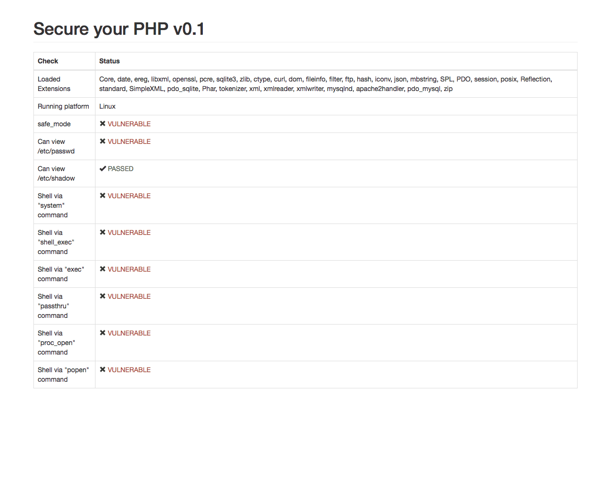

# Secure Your PHP
This can help you to ensure a proper security level for your PHP installation.

## Installation
Download `security-check.php` into your website folder.

## Usage
Open it in your browser.
For example: `http://your-website.com/path/to/security-check.php`

Then, you can view a report of the security check on your PHP installation.

